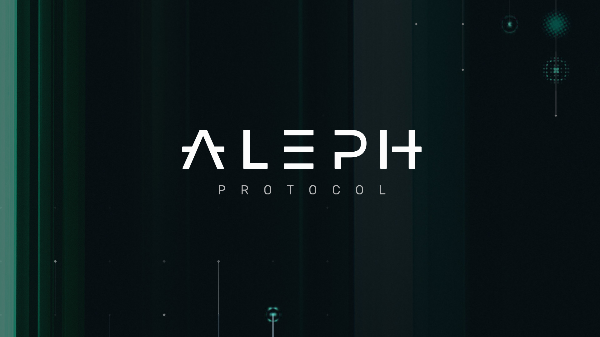

 

# Aleph Consensus

Aleph is an asynchronous and Byzantine fault tolerant consensus protocol aimed at ordering arbitrary messages (transactions). It has been designed to operate continuously under conditions where there is no bound on message-delivery delay and under the assumption that there is a significant probability of malicious behavior, making it an excellent fit for blockchain-related applications. For more information, check [the paper](https://arxiv.org/abs/1908.05156)

This repository contains an implementation founded by [Aleph Zero Foundation](https://alephzero.org).

# Results from experiments run on AWS

The following results come from experiments performed on 112 nodes of AWS EC2 instances distributed uniformly between 7 different regions across Europe and United States. We used the [m4.4xlarge instances ](https://aws.amazon.com/ec2/instance-types/) with 16 cores and 64 GiB memory. 

|load|txps|latency|
|---|---:|---:|
| 25.6 GiB/s  | 89600 tx/s | 416ms

# Installation

The implementation requires go version 1.12 and currently supports only Linux. It requires the following packages:

`go get github.com/onsi/ginkgo/ginkgo`

`go get github.com/onsi/gomega/... `

`go get -v -d -t ./... `

# Unit tests

To run unit tests please use the following command: `ginkgo -r -p`

# Experiments

There are two types of experiments that can be performed:
1. Local: go to `experiments/local/single_machine` and run `./run.sh addrs True`
2. Remote using AWS EC2:
  - Create an account on AWS, set up credentials, and a default region as described [here](https://boto3.amazonaws.com/v1/documentation/api/latest/guide/quickstart.html#configuration).
  - Install packages needed for orchestrating experiments: `GNU parallel` and Python 3 packages: `fabric, boto3, ipython`
  - Then, go to `experiments/aws` and run `python shell.py`. This opens a shell with procedures orchestrating experiments. The main procedure is
  `run_protocol(n_processes, regions, instance_type)` that runs `n_processes` spread uniformly across specified `regions`. It uses EC2 machines of `instance_type`.
  - Before running any experiments, it is required to create OS images in all AWS regions in which machines will be spawned. Run `create_images(regions)`, where `regions` is a list of all AWS regions of interest.
  - The most basic experiment can be run with `run_protocol(7, use_regions(), 't2.micro')`. It spawns 7 machines in 7 different regions: 4 in US and 3 in EU. As of time of writing, AWS EC2 was providing users with a limited time of free usage of machines of type `t2.micro` and some quota for free storage and data transfer, so such an experiment can be conducted free of charge.
  - The parameters of the protocol are defined in the file `pkg/config/config.go`.
  - After the experiment is finished, the logs containing useful data of the experiment can be downloaded with `get_logs` procedure.

# Analyzing logs

After collecting the logs, the performance can be analyzed as follows
    `python pkg/log_analyzer/loganal.py logs.zip`

# License

Aleph Go implementation is released under the Apache 2.0 license. See the `LICENSE.txt` for details
